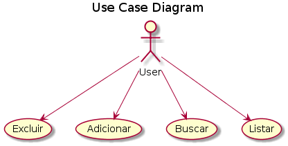
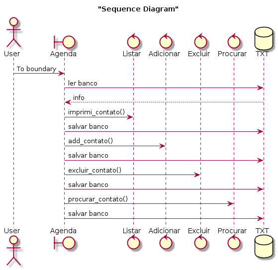
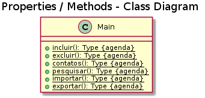

# agenda
##use case

O usuário do sistema terá a permissão para utilizar os seguintes métodos: excluir um contato, buscar um contato, adicionar um contato e listar todos os contatos.

##
##Diagrama de sequência

O usuário dá start na aplicação, a primeira ação do programa é ler o banco de dados e então fica esperando a entrada do usuário para saber qual método o mesmo quer utilizar.
O método lista  mostra todos os contatos da agenda em ordem alfabética.

O método adicionar adiciona um contato na agenda na sua ordem alfabética.

O método excluir lista todos os usuários em ordem e listando a ordem numérica deles, o usuário deve escrever qual posição do contato deseja excluir.

O método procurar espera um entrada do usuário de qual contato ele deve buscar no banco de dados.

Após cada interação de qualquer método a agenda e salva no banco.

##
## Diagrama de classe

 
